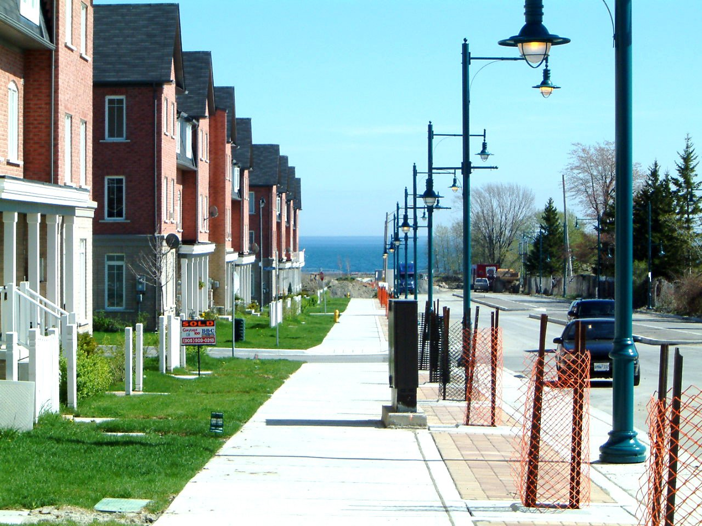

There were lots of security people and a very excited crowd outside the Khidmat Centre in Bradford; and there was a lot of apprehension inside the room where people from Near Neighbours and partner organisations were waiting to show the Duke and Duchess of Cambridge examples of the work going on every day in the city to promote mutual understanding across different communities.

The tension disappeared when Prince William and Kate entered the room with a smile on their faces: they were introduced to a few people and were asked to join in a facilitated activity where people were invited to position themselves along a line on the floor, according to their response to a specific statement.

“Different communities get on well in Bradford” was the statement which was read out; a big group of participants placed themselves on the ‘agree’ side, while a few others were more doubtful about this, and a couple went directly to the ‘disagree’ position.

Prompted by the facilitator, one of the participants explained why he agreed with the statement, giving some good example of work promoted by different communities in Bradford to bring people together and promote mutual understanding and social cohesion.

It was not difficult to understand his reasoning: some of those people were present in the room, and panels with pictures of different projects and artworks realised as part of community activities were displayed on the wall, including the amazing rugs of the Weaving Women’s Wisdom project, colourful creations of women of different faiths and backgrounds, who bonded in new friendships across difference while interlacing old pieces of fabric, and the inspiring Hope, a boat made with hand-shaped pieces of paper to raise awareness of the difficult journey that many refugees undertake to reach British shores and a more prosperous future.

DSCF7983.jpg
Prince William was interested in understanding why other people were standing in the ‘don’t know’ section despite the evidence that lots of positive work was going on in the local community, and he asked one of the ladies the reason for her choice. Hannah, a local curate in West Bowling, explained to him that she was involved in one of those projects called “Together We Can” which brings women of different backgrounds together to tackle drugs and litter in West Bowling, and described her experience very positively, but highlighted at the same time that there is still a lot of prejudice and misunderstanding outside those organised groups. The point was further reinforced by Farah, an Asian lady from the same group in West Bowling, who added examples of difficulties between various groups and of segregation between different communities.

Some people changed their mind during the discussion and Aleksandra, who works as Immigration Advisor for an organisation called UK Butterflies, remained the only one on the ‘disagree’ side, prompting the Prince to ask her directly to explain why: “I am an EU immigrant – she said – and I see many of the people from
Eastern Europe living an isolated life in this city, because of language barriers and difficulties in creating links with people of different cultures”. Though her organisation promotes educational initiatives and cultural events, she thinks there is still a lot of work to do and she is not happy with the situation as it is now.

Various points of view were heard from this exercise, and the royal couple moved to a table where another group of people were creating a banner with images and words about the positive impact of their organisation in the life of Bradford.

There was a brown handprint in the middle, with a small piece of white paper on top, saying “I am human”, and at one corner someone glued the headlines from a magazine “Ice Breaking” and added some light blue sprinkles on top. The meaning of those images was not immediately apparent, but the aim of the task was to ignite interest and promote a discussion.

Seated around the table were Fazul, who is the centre manager of the Bangladeshi Youth Association, Humayun, who founded the Bangla Bantams, a group of Bradford City Football Club supporters working to encourage more fans from diverse communities to attend the matches; Indi and Elsie from the Anchor project, supporting some of the most marginalised neighbourhoods in the city; Talat who founded the BD5 Dads and Kids group, and many others that were able to talk to the Royals about their own activities and how they try to promote mutual understanding and respect between different groups and communities.

DSCF7884.jpg
Prince William was really impressed by all the initiatives presented to him and said, "What you are all doing to help each other and bring the community together is very powerful.”

During the visit he experienced a real example of how, through games, activities and offering a safe environment, Near Neighbours promotes an open and honest conversation across difference and he added: “You can see that communities are trying to come together, trying to help each other, get to know each other and that is really crucial. If we can replicate that more across the country then it can only be for good - bringing everybody together, which is the reason why we want to get round the UK now and see as many places in the UK we may not have been very much to, and try to understand some of the more complex challenges."

Though some of the journalists present interpreted these words as a reference to the current difficulties in the Royal family, for all the people there it was clear that the Prince was instead talking about Bradford and community cohesion. In fact, both Prince William and Kate showed real interest in the stories that people told them and engaged in questions and conversation, willing to understand more about the city and the work of community groups there. They were very personal and direct in their interaction, and everybody was impressed by this very humble approach.

Before leaving, they received as a gift a painting made by a refugee from Iran, as part of a project led by BIASAN, an organisation helping refugees and asylum seekers in Bradford, that organised an exhibition at the National Museum of Media. Mussarat, who curated the exhibition explained the meaning of the painting, a window in an empty room overlooking a green tree outside, as a message of hope in the future (the tree), despite the difficulties of the current times (the empty room).

And while the Royals left the room, everybody there felt that this message of hope in the future was indeed the main legacy of the visit, and they all felt supported and encouraged in working for more integration and solidarity to make that message even stronger.

