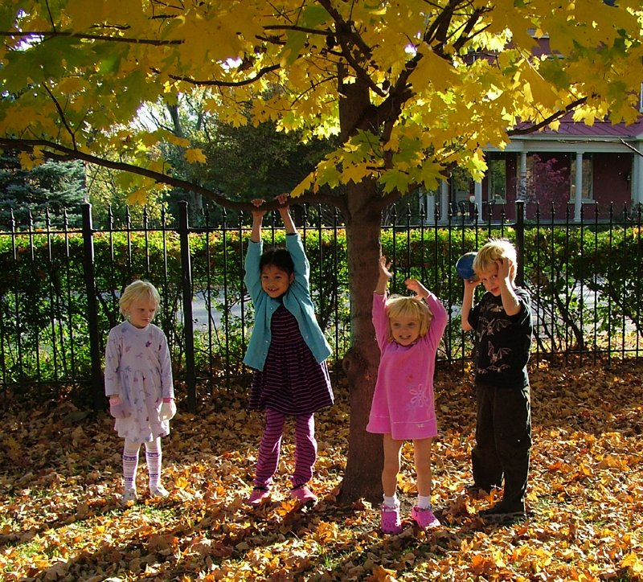

Welcomed by our local coordinator, Rabiyah K Latif, the Minister listened to Emma Rhymes (from the local YMCA), Rob Gunnell (from Erdington Litter Busters), Louise White (from Places of Welcome) and other local residents explaining how they work with people from different backgrounds to improve their local neighbourhood.

Rob, who is passionate about local environment,  has created a network of local volunteers looking after the streets and educating about rubbish and recycling. A small grant from Near Neighbours helped him to establish some street champions, who can become a point of reference for local residents on environmental issues.

Louise, who is the local coordinator of Places of Welcome in Birmingham, explained to the Minister the benefit of this grassroot programme, that can help people to feel connected to a specific area, belonging to a neighbourhood and willing to contribute to the local community.

The Minister was really interested and asked questions about loneliness and isolation in the area, and how to improve access to language courses for people who have difficulties or don’t speak English at all.

He also thanked all participants for their engagement and said he was "really impressed by the challenging activities" that were presented to him.

It was a great occasion to promote and celebrate the extraordinary work of Near Neighbours in the area.